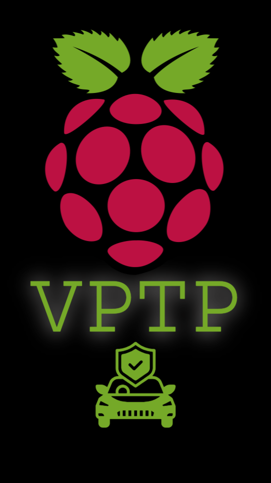

# VPTP - Vehicle Penetration Testing Platform

## Description
VPTP (Vehicle Penetration Testing Platform) is intended to be a *mobile* platform designed for quick-turnaround times in testing vehicle systems given a known set of security vulnerabilities. It's original intention is to be a wrapper OS, built on the commonly known raspbian distribution, due to it's hardware support.

The original platform is intended to be run on a Raspberry Pi 5, but should be able to be run on any hardware that can run Kali Linux. Details of the hardware used to develop the platform are included in the [Hardware](./hardware/hardware.md) documentation. Much of this work is done in collaboration with the research I do at Colorado State University, and is intended to be used for **educational purposes only.**

> Please note this is a Work In Progress (WIP) and is not yet complete. Feel free to contact me with any questions or concerns.

## Features

### Cryptographic Analysis

(Using the built-in cryptographic extensions of the Raspberry Pi 5 to speed up the process of cracking hashes, seed-key exchanges, etc.)

### Vehicle Diagnostics 

(Using the PCAN or CAN2USB adapters)
Tools planned to be included:
- [can-utils](https://github.com/linux-can/can-utils) for basic CAN bus analysis ✅
- [CanCat](https://github.com/atlas0fd00m/CanCat) for more advanced CAN bus analysis 
- [c0f](https://github.com/zombieCraig/c0f) for fingerprinting CAN bus systems
- [Canexplorer](https://github.com/Tbruno25/can-explorer) for quick reverse engineering of CAN bus systems ❌ (dearpygui not supported on pi 5 yet)
- [OpenDBC](https://github.com/commaai/opendbc) for reading and writing DBC files, and keeping track of vehicle databases
- [CaringCaribou](https://github.com/CaringCaribou/caringcaribou) for UDS analysis
- [TruckDevil](https://github.com/LittleBlondeDevil/TruckDevil) for J1939 analysis
- [ICSim](https://github.com/zombieCraig/ICSim) for educational purposes
- [UDSim](https://github.com/zombieCraig/UDSim) for educational purposes
- [SavvyCAN](https://www.savvycan.com/) for CAN bus analysis ➖ needs work on MQTT and [slcan](https://github.com/tixiv/lib-slcan) for remote CAN bus analysis
- [GNU Radio](https://www.gnuradio.org/) for SDR ➖ need to fix xtrx-dkms
- [Scapy Automotive](https://scapy.readthedocs.io/en/latest/installation.html) for packet crafting and injection
- [Jupyter Lab](https://jupyter.org/) for data analysis
- [Canmatrix](https://github.com/ebroecker/canmatrix) for reading and writing several database formats (e.g. .dbc, .dbf, .kcd, .arxml)
- [rpi_hardware_pwm](https://github.com/Pioreactor/rpi_hardware_pwm) for bitbanging via the PWM pins on the Raspberry Pi
- [Sigrok](https://sigrok.org/wiki/Main_Page) for the bitmagic basic logic analyzer
- [OpenOCD](https://openocd.org/) for the Tigard Protocol Tool

#### Python Development Environment:
- [Python-CAN](https://pypi.org/project/python-can/), [Python-OBD](https://python-obd.readthedocs.io/en/latest/), [Python-UDS](https://python-uds.readthedocs.io/en/latest/installation.html), [Python-can-isotp](https://github.com/pylessard/python-can-isotp), [Python-can-j1939](https://github.com/juergenH87/python-can-j1939), [Python-RP1210](https://pypi.org/project/RP1210/)

### Object Identification

(Using the Google Coral Mini PCIe Accelerator to identify parts of a vehicle, diagnostic ports, etc.)

### WiFi and Bluetooth Capturing

(Using the built-in WiFi and Bluetooth capabilities, or the SDR)

### RF Testing

(Using the SDR)

### Other 'Kali Linux' Tools

- nmap
- metasploit
- aircrack-ng
- etc.

### VPTP Quick Penetration Testing

(Using the built-in tools with a customized interface to provide quick turnaround times in finding common vulnerabilities in vehicle systems) --> (e.g. CAN bus, WiFi APs, Bluetooth, USB, etc.)

## Installation

### Build from Source

### Pre-built Images

## Usage

### Quick Start

### Advanced Usage

## Contributing

### Bug Reports

### Feature Requests

### Pull Requests

## License
[GNU General Public License v3.0](./LICENSE)
